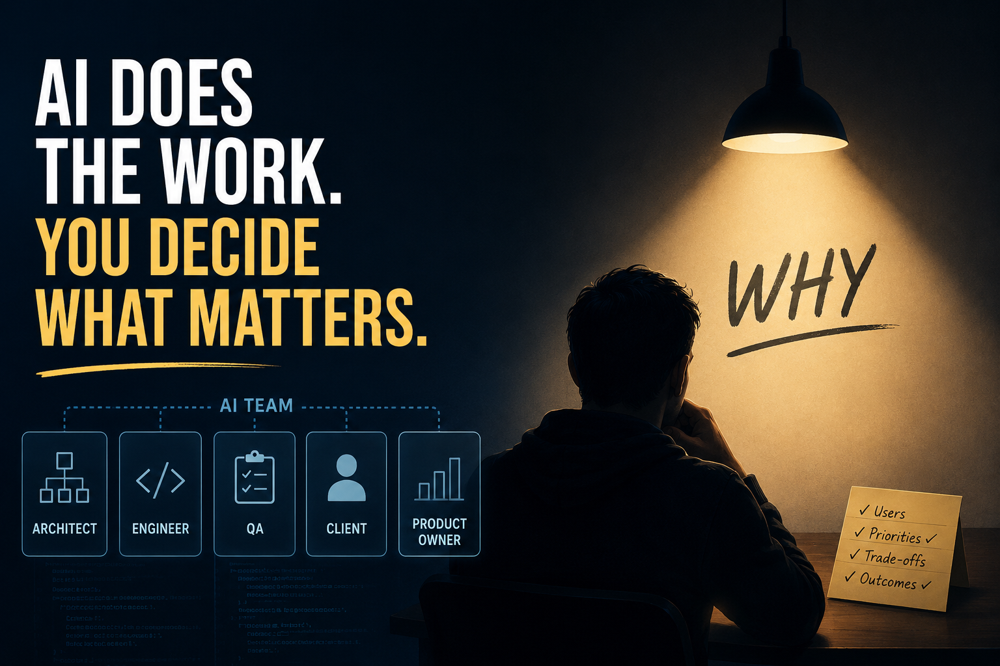

# The Day I Realized I Was the Least Intelligent Person in My Own Team

Today I built a team of AI agents: a software architect, a senior engineer, a product owner, a QA, and a client.

I gave them context, assigned roles, and watched them work.

They challenged assumptions, debated architecture decisions, gathered requirements, wrote specifications, and produced tens of thousands of lines of output.

I understood only a fraction of it.

For the first time, I felt genuinely uncomfortable.

If they're doing most of the thinking and most of the building, what exactly is my role?

## The part nobody talks about

The difficult part wasn't feeling replaceable.

It was wondering how I would continue to grow.

Most of my expertise came from doing the work myself—making mistakes, solving problems, and slowly building intuition.

Now I was watching agents move faster than I could follow.

If I couldn't fully understand what they were producing today, how would I understand more tomorrow?

That question stayed with me longer than I expected.

## The insight

After sitting with it, I realized something.

Every agent in the room knew how to build.

None of them knew what was worth building.

They didn't know which user problem mattered most.

They didn't know which tradeoff would create the best outcome.

They didn't know when a technically correct solution was the wrong solution.

Those decisions still required someone with context, judgment, and responsibility for the outcome.

The bottleneck was no longer execution.

It was judgment.

## What changed for me

I stopped trying to inspect every output.

Instead, I started reviewing the reasoning behind major decisions.

I ask my product owner agent why a decision was made, what alternatives were considered, and what assumptions were accepted.

That's where I'm learning now.

Not by competing with the agents, but by understanding how decisions are made and whether they serve the people using the product.

## What I'm still figuring out

AI has changed how work gets done.

What I'm less certain about is how expertise develops in a world where much of the execution is automated.

My current answer is that judgment matters more than ever.

Not judgment about code.

Judgment about people, priorities, tradeoffs, and outcomes.

The agents can generate solutions.

Someone still has to decide which problem deserves one.

*Written after a real day of building. Still figuring it out.*
